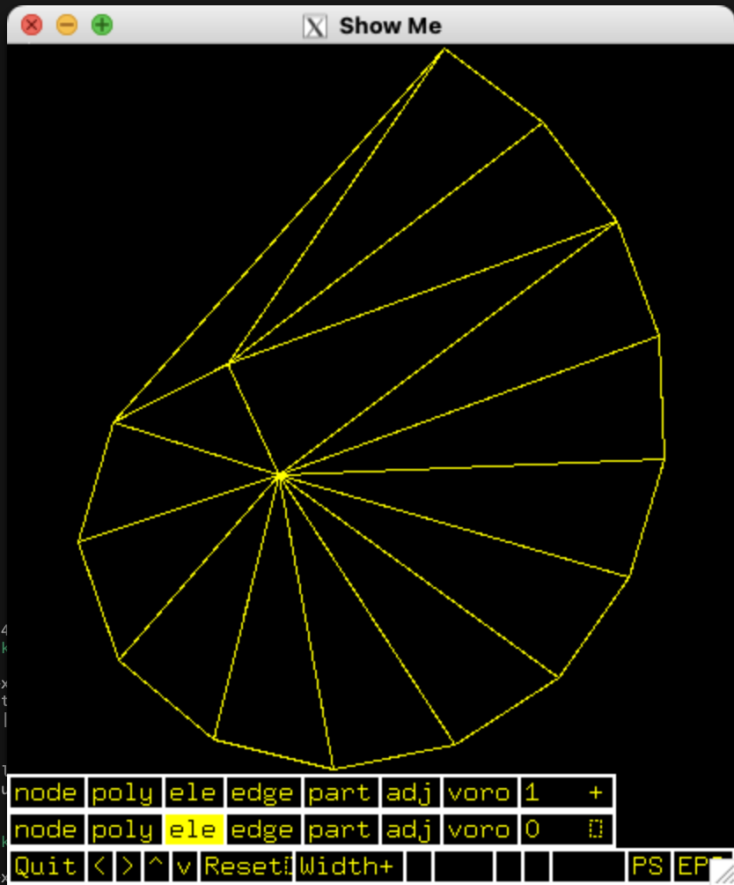

## CS274 Divide and ConquerDelaunay Triangulation Project :D



## setup

```bash
# standard c++ 17
(base) Jay_Y@MacBook-Pro-849:~/Desktop/cs274/project$ g++ --version
Apple clang version 21.0.0 (clang-2100.0.123.102)
Target: arm64-apple-darwin25.3.0
Thread model: posix
InstalledDir: /Applications/Xcode.app/Contents/Developer/Toolchains/XcodeDefault.xctoolchain/usr/bin
```

```bash
cd shewchuk && make trilibrary && cd ..
```

## compilation

```bash
# normal
cc -O -c shewchuk/predicates.c -o pred.o && g++ -O -o my_project my_project.cpp pred.o -lm && ./my_project
```

```bash
# warnings suppressed
cc -O -Wno-deprecated-non-prototype -c shewchuk/predicates.c -o pred.o && \
g++ -O -Wno-c++17-extensions -o my_project my_project.cpp pred.o -lm && \
./my_project
```

## usage

```bash
./my_project <input_node_file> [alternating_cuts_flag]
example1: ./my_project tests/spiral.node vertical
example2: ./my_project tests/ttimeu1000000.node alternating
```

## my timings (excluding time for reading input and writing to output)

| test                     | Vertical | Alternating | Vertical (total time) | Alternating (total time) |
| ------------------------ | -------- | ----------- | --------------------- | ------------------------ |
| tests/ttimeu10000.node   | 15 ms    | 14 ms       | 59 ms                 | 57 ms                    |
| tests/ttimeu100000.node  | 125 ms   | 117 ms      | 650 ms                | 509 ms                   |
| tests/ttimeu1000000.node | 1788 ms  | 1569 ms     | 7730 ms               | 6302 ms                  |

## final thoughts

Wow, this project was so hard. I didn't think that alternating would be so challenging. I had to change my setup completely to store all 4 hulls. I didn't even consider that in my design to begin with. Truly humbling experience. Also, how am I still 4 times slower than triangle.c even after alternating cuts? black magic. 
